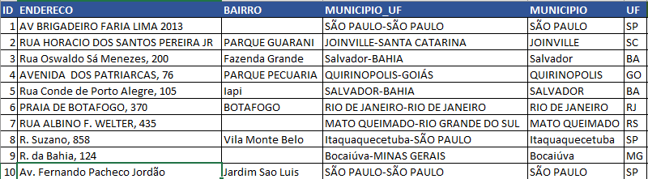
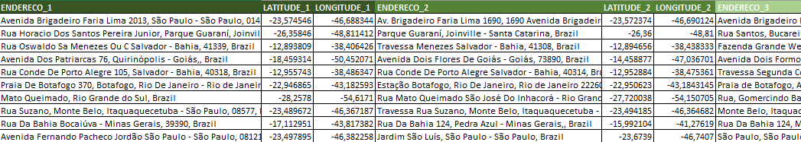

# Busca de coordenadas geográficas - Mapbox API
 
Esse projeto tem o objetivo de oferecer um serviço de busca de coordenadas geográficas a partir de endereço(s) informado(s) em uma planilha. A arquitetura da solução:


### Tecnologias:

- Flask: Micro-framework escrito em python para desenvolvimento web;
- Mapbox Geocoding API: API do Mapbox(https://www.mapbox.com/place-search/) para coleta das coordenadas;
- Postgresql: Banco de dados para armazenamento das consultas;
- Docker: Container para rodar e isolar a aplicação;

## Como rodar

Iniciar na raiz do diretório do projeto:

```bash
docker-compose up
```
Assim que executar, basta acessar o "localhost:5000" no seu navegador.


⚠️ Utilize o arquivo de excel como layout [aqui](file/)

Seguindo o modelo do excel (mesmo nome/nr. de colunas), a API está configurada para retornar até 3 localizações mais próximas da busca e somente é valido para endereços do **Brasil**. O resultado próximo seria como esse:

**Busca:** 



**Resultado:**



Obs.:
- O Geocoding API do Mapbox aceita até 100.000 requests gratuitos, passando disso é pago.
- Pode ser consultado endereço de qualquer país, mas limitei a busca apenas para o Brasil;
- Documentação da API: https://docs.mapbox.com/api/search/#geocoding 


